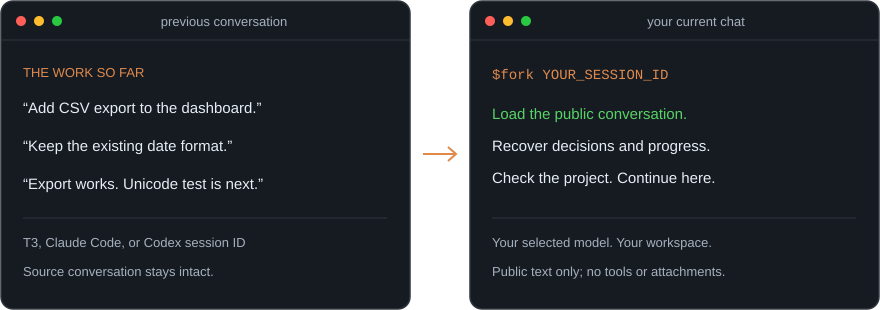
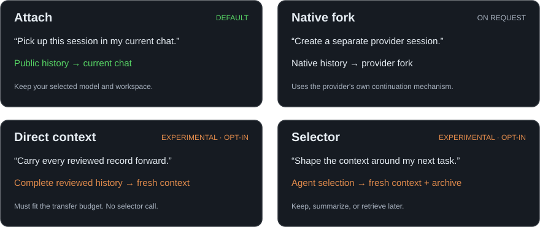
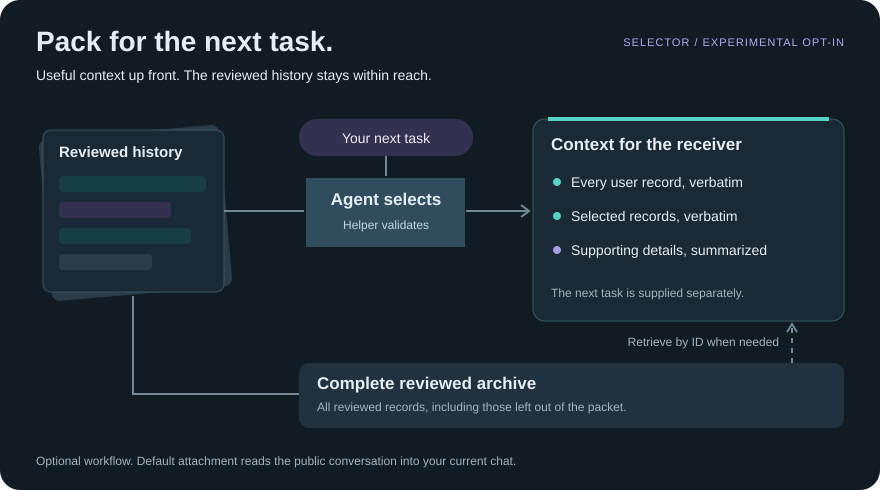

<h1 align="center">Better Fork</h1>

<p align="center">
  <strong>New chat. Same project. Pick up where you left off.</strong>
</p>

<p align="center">
  Bring a previous T3 Code, Claude Code, or Codex conversation into your current chat.<br>
  Keep your chosen model and workspace. No proxy, service, account, or API key.
</p>

<p align="center">
  <a href="#install"></a>
  <a href="#benchmark"></a>
  <a href="#honest-limits"></a>
</p>

<p align="center">
  <a href="#install">Install</a> ·
  <a href="#how-it-works">How it works</a> ·
  <a href="#use-dynamic-mode">Dynamic mode</a> ·
  <a href="#benchmark">Benchmark</a> ·
  <a href="#honest-limits">Honest limits</a>
</p>

<p align="center">
  
</p>

You already explained the project once. Better Fork gives the next chat that history so you can get back to work.

## Why “Better” Fork?

Built-in forks are designed to continue the same session with its native context. That is great when the next task is more of the same, but forking should not be one-size-fits-all.

Better Fork lets the next task determine the context it receives: load the public conversation into your current chat, preserve a separate native fork, transfer the complete reviewed history, or let an agent build a focused context packet when the direction changes. You keep control of the model, workspace, and continuation mode.

## Install

Install the `fork` skill with the open skills installer:

```bash
npx skills add kgarg2468/better-fork --skill fork
```

In Codex, invoke it as `$fork`; `/fork` may be intercepted by the native client command. In Claude Code installations that expose skills as slash commands, use `/fork`.

You can also clone the repository and copy `skills/fork` into your agent's skills directory.

## How it works

In your receiving chat, invoke the skill with the previous conversation's ID:

```text
$fork YOUR_SESSION_ID
```

Better Fork finds the local source conversation, reads its public user/assistant text, and recovers the task, constraints, decisions, and progress. The agent checks the relevant project files before editing and continues in your current model and workspace.

T3 Code thread IDs (including Grok threads) and native Claude Code or Codex session IDs are accepted. The source history must be accessible locally. Tool results, attachments, hidden reasoning, streaming output, and provider instructions are excluded from this attachment.

### Using a T3 Code thread ID

The thread ID shown by T3 Code identifies the conversation in T3 Code. It is distinct from the underlying Claude Code or Codex session ID. You can paste that T3 Code ID directly:

```text
$fork YOUR_T3_CODE_THREAD_ID
Continue this conversation here independently and leave the original chat untouched.
```

Your receiving chat is already a separate conversation. Better Fork reads the source history into it without changing the original thread or opening another app. If the source has a queued, running, or interrupted turn, it attaches through the last completed turn and tells you which unfinished content was excluded. All pages use that same completed boundary. A thread with no completed history reports that limitation.

Conversation separation does not isolate project files: two chats using the same workspace can still edit the same files. On multiple computers, run the skill where the source history is stored. Installing it on another node does not copy or synchronize your conversations.

## Choose how to continue

Different next steps need different context. Loading history into the current chat is the default; separate native forks and fresh-context experiments are available when requested.

<p align="center">
  
</p>

| Route | When it runs | Context behavior |
| --- | --- | --- |
| **Attach** | `$fork ID`; default | Loads public user/assistant history into this chat; keeps your current model and workspace |
| **Native** | Explicit separate-session request with a native Claude Code or Codex ID | Uses the provider's native fork, preserving native session context |
| **Direct** | Explicit fresh-context opt-in | Transfers every reviewed public record, exactly and in order; no selector call |
| **Selector** | Explicit experimental selector opt-in | Builds a model-selected context packet with a recoverable archive of all reviewed records |

Attachment loads conversation history; it does not merge backend session identities. T3 Code thread IDs support attachment into your current chat. Creating an additional native session requires a native Claude Code or Codex ID and a supported host launch mechanism; otherwise the skill provides a handoff and says the session has not been created.

## Context for the next task

Changing direction? The optional selector workflow lets an agent decide which reviewed context belongs in the next thread: retain useful records, summarize supporting details, and leave the rest available for retrieval.

### Use dynamic mode

Start a new chat and make the mode, source session, next task, and delegation permission explicit:

```text
$fork YOUR_SESSION_ID

Use dynamic mode for this fork.
My next task is: YOUR_NEXT_TASK
You may delegate context selection to another agent.
```

Better Fork reviews the public conversation and gives the selector your next task. The selector keeps every user message verbatim, chooses which assistant or public tool records remain verbatim, and summarizes supporting details. The complete reviewed history is archived for recovery if the new thread needs something that was not selected.

Dynamic mode is experimental and never runs from `$fork ID` alone. It excludes hidden reasoning, system instructions, private provider data, attachments, and unreviewed tool output. If the host cannot create a fresh receiver, Better Fork prepares a handoff instead of claiming that a new session exists.

<p align="center">
  
</p>

Every user record stays verbatim. The helper validates the selection and stores the complete reviewed archive so the receiver can retrieve missing details. This experimental workflow requires explicit selector opt-in and permission to delegate; it does not run on every `$fork`.

<details>
<summary><strong>Transfer rules and implementation details</strong></summary>

The read-only resolver resolves T3 thread IDs or provider-native session IDs and returns the source provider, cwd, model, and boundary metadata. It returns provider-specific launch arguments only for native Claude Code and Codex sessions. It never assumes the source provider from whichever agent happens to be running the skill.

Direct mode is admitted only when reviewed public-history coverage is complete and its entire serialized packet fits a 24,000-character transfer budget. The limit is not a model context-window claim. Partial or oversized history returns `native_required`; unsafe or invalid input fails closed. History is never silently truncated.

Fresh-context workflows accept reviewed `user`, `assistant`, and public `tool` records. System/developer text, hidden reasoning, private provider internals, secrets, and raw native exports are excluded. The default attachment reader extracts user/assistant text only.

See the [workflow](skills/fork/references/workflow.md) and [direct-context contract](skills/fork/references/direct.md) for exact behavior.

</details>

## Benchmark

The fixed development comparison tested three routes: native, the older selector workflow, and Better Fork's direct workflow. It ran on Codex and Claude Code, but did **not** measure the current default attachment workflow.

| Provider | Native mean | Selector mean | Better Fork direct | Direct vs native | Direct input vs native | Direct cost vs native |
| --- | ---: | ---: | ---: | ---: | ---: | ---: |
| Codex | 118.6 s | 117.3 s | **108.0 s** | **8.9% faster** | 10.9% more | Unknown |
| Claude Code | 61.0 s | 68.8 s | **45.1 s** | **26.0% faster** | 28.7% more | **2.3% lower** |

All three routes passed all assigned coding and observed-workflow checks:

| Provider | Native | Selector | Direct |
| --- | ---: | ---: | ---: |
| Codex | 4/4 | 4/4 | 4/4 |
| Claude Code | 4/4 | 4/4 | 4/4 |
| **Total** | **8/8** | **8/8** | **8/8** |

<details>
<summary><strong>Full paired results and benchmark protocol</strong></summary>

Best time in each row is bold. The slower Codex direct result is intentionally visible.

| Provider | Task family | Repeat | Native | Selector | Direct |
| --- | --- | ---: | ---: | ---: | ---: |
| Codex | Integer clock | 1 | 100.3 s | 110.1 s | **81.9 s** |
| Codex | Integer clock | 2 | 104.9 s | 108.3 s | **76.0 s** |
| Codex | Unicode CSV | 1 | 129.5 s | **110.2 s** | 139.1 s |
| Codex | Unicode CSV | 2 | 139.8 s | 140.6 s | **135.1 s** |
| Claude Code | Integer clock | 1 | 39.8 s | **32.0 s** | 37.7 s |
| Claude Code | Integer clock | 2 | 49.9 s | 51.2 s | **36.8 s** |
| Claude Code | Unicode CSV | 1 | 77.6 s | 78.4 s | **54.8 s** |
| Claude Code | Unicode CSV | 2 | 76.5 s | 113.7 s | **51.2 s** |

### Protocol

- Two previously observed development task families, repeated twice per route and provider.
- Twelve attempts and 28 model calls per provider; 24 attempts and 56 calls total.
- Two receiving turns per attempt from byte-identical repository checkpoints.
- Requested receivers: `gpt-5.6-sol` at low effort for Codex and `claude-opus-5[1m]` at low effort for Claude Code.
- Quality required both isolated coding-grader success and observed-workflow success.
- End-to-end wall time included deterministic preparation, selector calls where applicable, both receiver turns, and grading.
- Claude cost is the CLI's reported estimate, not an invoice. Codex supplied no cost estimate.

The direct route transferred every reviewed public record in all eight direct attempts, with no selector calls, truncations, integrity failures, or native fallbacks. The local implementation and benchmark plumbing passed 127 tests.

</details>

## Honest limits

This benchmark supports one bounded conclusion: **direct context is a promising fast path for short, complete, changed-direction histories.** It does not prove that Better Fork is generally better than native Codex or Claude Code forking.

- There were only two independent task families; repeats are not new independent samples.
- These were known development cases, not held-out natural coding sessions or long histories.
- Direct used more input tokens than native on both providers.
- One of four Codex pairs was slower with direct context.
- Native can retain provider-private state and cached context that a reviewed public projection cannot reproduce.
- All outputs passed these graders, but no architecture can guarantee agent output quality.
- Recovery was available but not invoked by these tasks, so successful recovery behavior was not established by the live comparison.

Current-chat attachment is the default. Separate native forks are explicit; direct and selector modes are experimental opt-ins.

## Repository

```text
skills/fork/
├── SKILL.md
├── references/
│   ├── direct.md
│   └── workflow.md
└── scripts/
    ├── direct_context.py
    ├── fork_context.py
    ├── read_history.py
    ├── resolve_session.py
    ├── test_read_history.py
    └── test_resolve_session.py
```

The helper scripts use only the Python standard library. Better Fork does not replace a client's built-in `/fork` command.
